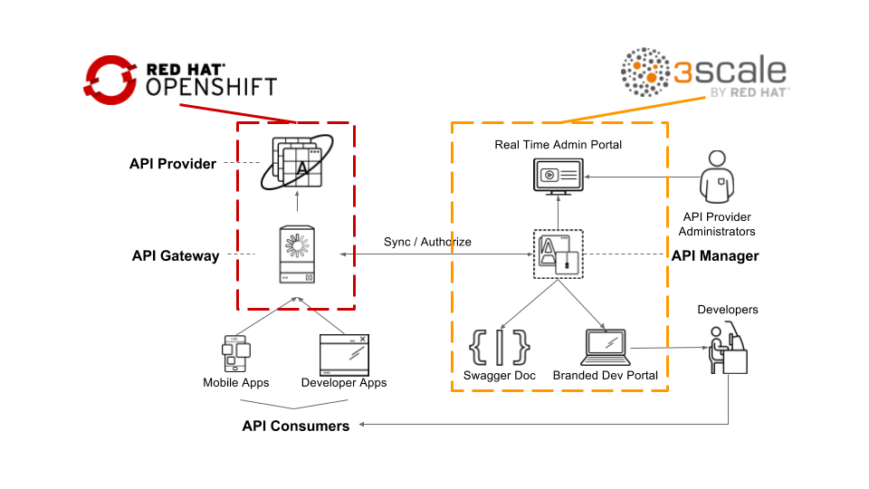
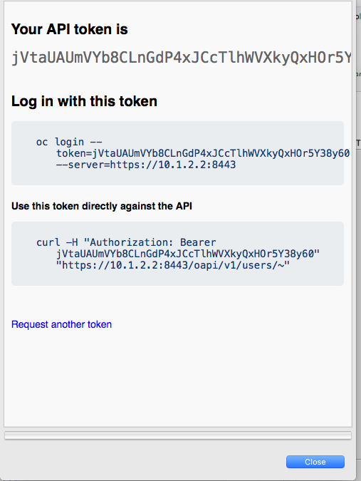
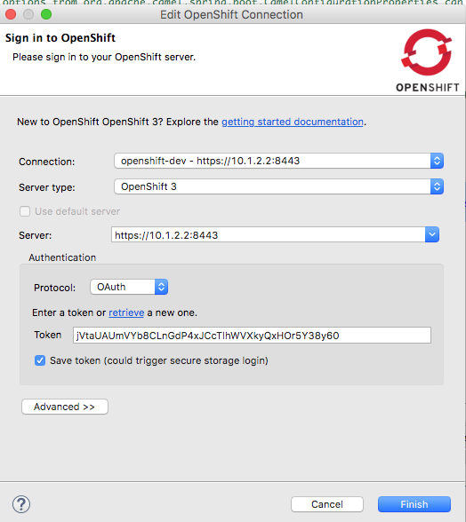

# Red Hat Agile API Integration Workshop - Microservices-based Managed API Integration
# Replacement Installation Instructions

This very simple lab will guide you to create your very first Fuse-based SpringBoot microservice project running on OpenShift. There are 4 sections in the labs.

* Create a project that read from a database
* Expose a restful API endpoint to access data in the database
* Deploy your application on OpenShift
* Manage and control the access to your API using 3scale

## Red Hat 3scale API Management Platform Account
This lab focuses on the deployment and administration of Red Hat 3Scale. One deployment topology available is known as a *hybrid* approach. A *hybrid* Red Hat 3Scale deployment topology is one in which the 3Scale API gateway is self-managed in your own environment. This self-managed API gateway is in two-way communication with the hosted Red Hat 3Scale SaaS API Management Platform (AMP).



The focus of lab 04 of this course is on this hybrid deployment topology. Subsequently, the lab 04 make heavy use of your account in the Red Hat 3Scale SaaS AMP. If you do not have a Red Hat 3Scale SaaS, please register for free trial one at: https://www.3scale.net/signup/.

You will receive an email in your inbox to complete the signup process and activate your account.

## Installation
Before you begin, please make sure the following software are properly installed (orry Linux users, you are on your own)

* Copy the Virtual Box installer and .VDI image to your local file system
* Install Virtual Box

## Installing the VDI
* In Virtual Box, click "New"
* Name the image. The Type will be "Linux" and the OS version will be Red Hat (64-bit)
* Give the image around 4GB of memory
* Click Next
* When supplying the Hard Disk, select "Use an existing virtual hard disk file"
* Select the yellow folder icon and select the AgineIntegration.vdi file you copied from the thumb drive

## Starting up the VDI
Once installed, simply run the VM and log in:
* Start the VM from the VirtualBox control panel
* The credentials to log into the VM are JBoss/r3dh4t1!

Open a Terminal Window. To start up your local Openshift instance

```
oc cluster up
```
## Initializing the VDI
A few housekeeping items are needed for this lab:

Login as admin

```
oc login -u admin
Authentication required for https://10.1.2.2:8443 (openshift)
Username: admin
Password: r3dh4t1!
Login successful.

```

Install Fuse image stream on OpenShift and Database template for this lab

```
#FIS image
oc create -f https://raw.githubusercontent.com/jboss-fuse/application-templates/master/fis-image-streams.json -n openshift

#MYSQL Database
oc create -f https://raw.githubusercontent.com/openshift/origin/master/examples/db-templates/mysql-ephemeral-template.json -n openshift
```

log back in as a developer

```
oc login -u openshift-dev
Authentication required for https://10.1.2.2:8443 (openshift)
Username: openshift-dev
Password:
Login successful.

```

Access OpenShift console by going to the following URL in the browser.

```
https://localhost:8443

```

##JBoss Developer Studio

To lauch JBoss Developer Studio, double-click on the icon on yourr desktop to launch

In the OpenShift Explorer view, click on **New Connection Wizard..** to configure OpenShift setting
Enter **https://localhost:8443** as the **Server** and click on the **retrieve** link to access the token.



In the popup window, log in as Developer using ID/PWD openshift-dev/r3dh4t1!. Select ok and check the **Save token** box.



## Windows Users

- Make sure you disable  Hyper-V functionality under Control Panel
- Add _config.ssh.insert\_key=false_ to **Vagrantfile** ${DEVSUITE_INSTALLATION_PATH}/cdk/components/rhel/rhel-ose/

Thanks to @sigreen

## FAQ
- How to install Maven?  
	- Go to https://maven.apache.org/install.html for detail instructions
- Maven dependency not found?
	- ${MAVEN_INSTALLED_DIR} if you are having trouble downloading from the repositories
